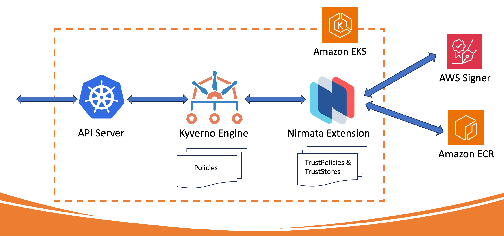

# kyverno-notation-aws

A [Kyverno](https://kyverno.io) extension service that executes the [AWS Signer](https://docs.aws.amazon.com/signer/index.html) plugin for [Notation](https://notaryproject.dev/) to verify image signatures and attestations.

[](https://goreportcard.com/report/github.com/nirmata/kyverno-notation-aws)




# Setup
1. Setup your environment variables:
```sh
# These are just examples, use your own values
export IMAGE="844333597536.dkr.ecr.us-west-2.amazonaws.com/kyverno-demo:v1"
export UNSIGNED_IMAGE="844333597536.dkr.ecr.us-west-2.amazonaws.com/kyverno-demo:v1-unsigned"
export AWS_SIGNER_PROFILE_NAME=kyvernodemo
export AWS_SIGNER_PLATFORM_ID=Notation-OCI-SHA384-ECDSA
```
2. Create an AWS Signer signing profile:

```sh
aws signer put-signing-profile --profile-name $AWS_SIGNER_PROFILE_NAME --platform-id $AWS_SIGNER_PLATFORM_ID --signature-validity-period 'value=12, type=MONTHS'
```

2. Get the signing profile ARN

```sh
 aws signer get-signing-profile --profile-name kyvernodemo
{
    "profileName": "kyvernodemo",
    "profileVersion": "2oCN6RHYVI",
    "profileVersionArn": "arn:aws:signer:${REGION}:${ACCOUNT}:/signing-profiles/kyvernodemo/2oCN6RHYVI",
    "platformId": "Notation-OCI-SHA384-ECDSA",
    "platformDisplayName": "Notary v2 for Container Registries",
    "signatureValidityPeriod": {
        "value": 12,
        "type": "MONTHS"
    },
    "status": "Active",
    "arn": "arn:aws:signer:${REGION}:${ACCOUNT}:/signing-profiles/kyvernodemo",
    "tags": {}
}
```

3. Configure the signer in notation

```sh
notation key add --id arn:aws:signer:${REGION}:${ACCOUNT}:/signing-profiles/${AWS_SIGNER_PROFILE_NAME} --plugin com.amazonaws.signer.notation.plugin kyvernodemo
```

4. Sign the image using `notation` and the AWS signer:

(you may need to login to ECR first: `aws ecr get-login-password --region ${REGION} | notation login --username AWS --password-stdin ${REGISTRY}`)

```sh
notation sign $IMAGE --key kyvernodemo --signature-manifest image
```

# Install

1. Install Kyverno in the cluster

```sh
kubectl create -f https://raw.githubusercontent.com/kyverno/kyverno/main/config/install-latest-testing.yaml
```

**Note: Kyverno v1.11.0 or higher is required**
2. Install the kyverno-notation-aws extension service

```sh
kubectl apply -f configs/install.yaml
```
> Note: If you have installed Kyverno in a custom namespace or are using a custom service account, you should use the `--allowedUsers` flags to provide the list of service that can access kyverno-notation-aws. You can disable token authorization altogether using `--reviewKyvernoToken` flag.

3. Create resources for the Notation TrustPolicy and TrustStore

```sh
kubectl apply -f configs/crds/
```

```sh
kubectl apply -f configs/samples/truststore.yaml
```

**NOTE 1**: Update the `${REGION}`, `${ACCOUNT}` and `${AWS_SIGNER_PROFILE_NAME}` in the [trustpolicy.yaml](configs/samples/trustpolicy.yaml) and then install in your cluster:

**NOTE 2**: The sample is configured to use commercial regions. For AWS GovCloud (US) see [Using AWS GovCloud](#using-other-regions).

```yaml
    trustedIdentities:
    - "arn:aws:signer:${REGION}:${ACCOUNT}:/signing-profiles/kyvernodemo"
```

```sh
kubectl apply -f configs/samples/trustpolicy.yaml
```

1. Apply the policy to the cluster

```sh
kubectl apply -f configs/samples/kyverno-policy.yaml
```

5. Configure ECR Registry credentials

If you are using IRSA (recommended):

a. Setup a custom policy `notation-signer-policy` with the following permissions:

```json
{
    "Version": "2012-10-17",
    "Statement": [
        {
            "Sid": "VisualEditor0",
            "Effect": "Allow",
            "Action": [
                "signer:GetRevocationStatus"
            ],
            "Resource": "*"
        }
    ]
}
```

b. Setup an IRSA role `kyverno-notation-aws` and attach two policies to it:
* the `notation-signer-policy` 
* the `AmazonEC2ContainerRegistryReadOnly` policy

c. Configure [IRSA](https://docs.aws.amazon.com/eks/latest/userguide/iam-roles-for-service-accounts.html) for your cluster

d. Configure the `kyverno-notation-aws` ServiceAccount in the [install.yaml](configs/install.yaml) with the correct role:

```yaml
apiVersion: v1
kind: ServiceAccount
metadata:
  name: kyverno-notation-aws
  namespace: kyverno-notation-aws
  annotations:
    eks.amazonaws.com/role-arn: arn:aws:iam::${aws_account_id}:role/kyverno-notation-aws
```

If you are NOT using IRSA you can configure registry credentials and IAM tokens as follows:

```sh
aws sso login
```

```sh
AWS_TOKEN=$(aws ecr get-login-password --region us-east-1)
```

```sh
kubectl create secret docker-registry regcred --docker-username=AWS --docker-password=$AWS_TOKEN --docker-server=844333597536.dkr.ecr.us-east-1.amazonaws.com -n kyverno-notation-aws 
```

Update the `kyverno-notation-aws` Deployment in the [install.yaml](configs/install.yaml) to add the `--imagePullSecrets=regcred` argument:

6. Test signed and unsigned images:

Create the test namespace which the [policy](configs/samples/kyverno-policy.yaml) applies to:

```sh
kubectl create ns test-notation
```

Run a signed image:

```sh
kubectl -n test-notation run test --image=$IMAGE --dry-run=server
```
Output
```sh
pod/test created (server dry run)
```
Attempt to run an unsigned image:

```sh
kubectl -n test-notation run test --image=$UNSIGNED_IMAGE
```
Output
```sh
Error from server: admission webhook "mutate.kyverno.svc-fail" denied the request: mutation policy check-images error: failed to apply policy check-images rules [call-aws-signer-extension: failed to load context: failed to fetch data for APICall: HTTP 406 Not Acceptable: failed to verify container kyverno-demo: failed to verify image {{844333597536.dkr.ecr.us-west-2.amazonaws.com kyverno-demo kyverno-demo v1-unsigned } /spec/containers/0/image}: no signature is associated with "844333597536.dkr.ecr.us-west-2.amazonaws.com/kyverno-demo@sha256:74a98f0e4d750c9052f092a7f7a72de7b20f94f176a490088f7a744c76c53ea5", make sure the artifact was signed successfully
]
```
# Troubleshoot

1. Check service

```sh
kubectl -n kyverno-notation-aws logs deploy/kyverno-notation-aws -f
```

The logs should show:

```sh
Defaulted container "kyverno-notation-aws" out of: kyverno-notation-aws, kube-notation
2023-04-30T18:22:28.438Z	INFO	kyverno-notation-aws/main.go:46	configuring notation	{"dir.UserConfigDir": "/notation", "dir.UserLibexecDir": "/notation"}
2023-04-30T18:22:28.459Z	INFO	kyverno-notation-aws/verify.go:65	initialized	{"namespace": "kyverno-notation-aws", "secrets": "regcred"}
2023-04-30T18:22:28.460Z	INFO	kyverno-notation-aws/main.go:68	Listening...
```


2. Run netshoot

```sh
kubectl run netshoot --rm -i --tty --image nicolaka/netshoot
```
3. Set the `--reviewKyvernoToken` flag to `false` in kyverno-notation-aws deployment.

4. Use curl to make a call to the service as follows:

```sh
curl -k https://svc.kyverno-notation-aws/checkimages -X POST -d '{"images": {"containers":{"test":{"registry":"844333597536.dkr.ecr.us-west-2.amazonaws.com","path":"kyverno-demo","name":"kyverno-demo","tag":"v1"}}}}'
```

The output should look like this:

```sh
{
    "digests": {
      "844333597536.dkr.ecr.us-east-1.amazonaws.com/net-monitor:v1": "sha256:4ee9dc6abbf5e8181101fc1f8cd6d91ec0c5657f8c71274a8209637630eec48d"
    },
    "verified": true
}
````


# Features

## Image Signature Verification

The Nirmata extension service is invoked from a Kyverno policy which passes it a list of images to be verified. The service then verifies [notation](https://notaryproject.dev/) format signatures for container images using the [AWS Signer](https://docs.aws.amazon.com/signer/index.html) notation plugin and returns responses back to Kyverno.

The service manages Notation [trust policies](https://github.com/notaryproject/specifications/blob/main/specs/trust-store-trust-policy.md#trust-policy) and [trust stores](https://github.com/notaryproject/specifications/blob/main/specs/trust-store-trust-policy.md#trust-store) as Kubernetes resources.

## Image Digest Mutation

To ensure image integrity and prevent tampering, the service replaces image tags, which are mutable and can be spoofed, with digests.  

The Kyverno policy passes the `images` variable to the services' `/checkimages` endpoint. The result returns a list of images with their JSON path and digests so Kyverno can mutate each image in the admission payload. 

Here is an example:

**Response object structure**

```json
{
  "verified": true,
  "message": "...",
  "results": [
    {
      "op": "replace",
      "path": "/spec/containers/0/image",
      "value": "<ACCOUNT>.dkr.ecr.<REGION>.amazonaws.com/<REPO>@sha256:4a1c4b21597c1b4415bdbecb28a3296c6b5e23ca4f9feeb599860a1dac6a0108" 
    }
  ]
}
```

**Kyverno policy fragment**

```yaml 
mutate:
   foreach:
   - list: "response.results"
     patchesJson6902: |-
       - path: '{{ element.path }}'
         op: '{{ element.op }}'
         value: '{{ element.value }}'
```

## Attestation Verification

In addition to verifying signatures, the extension service can verify signed metadata i.e. [attestations](https://nirmata.com/2022/03/15/a-map-for-kubernetes-supply-chain-security/).

To verify attestations, the Kyverno policy can optionally pass a variable called `attestations` in the request:

```yaml
- key: attestations
  value:
    - imageReference: "*"
      type: 
        - name: sbom/cyclone-dx
          conditions:
            all:
            - key: \{{creationInfo.licenseListVersion}}
              operator: Equals
              value: "3.17"
              message: invalid license version
        - name: application/sarif+json
          conditions:
            all:
            - key: \{{ element.components[].licenses[].expression }}
              operator: AllNotIn
              value: ["GPL-2.0", "GPL-3.0"]
    - imageReference: "844333597536.dkr.ecr.us-west-2.amazonaws.com/kyverno-demo*" # this is just an example
      type:
        - name: application/vnd.cyclonedx
          conditions:
            all:
            - key: \{{ element.components[].licenses[].expression }}
              operator: AllNotIn
              value: ["GPL-2.0", "GPL-3.0"]
```

The `attestations` variable is a JSON array where each entry has:
1. an `imageReference` to match images; 
2. a type which specifies the name of the attestation; and 
3. a list of conditions we want to verify the attestation data

In the  example above we are verifying the following: 
1. the attestations `sbom/cyclone-dx` and `application/sarif+json` exist for all images
2. the `creationInfo.licenseListVersion` is equal to 3.17 in the SBOM and GPL licenses are not present.
3. the attestation `application/vnd.cyclonedx` is available for all versions of the `844333597536.dkr.ecr.us-west-2.amazonaws.com/kyverno-demo` image and does not contain GPL licenses.

**NOTE:** The conditions key in the attestations must be escaped with `\` so Kyverno does not substitute them before executing the extension service.

## Caching

To prevent repeated lookups for verified images, the Nirmata extension has a built-in cache.

Caching is enabled by default and can be managed using the `--cacheEnabled` flag. The cache is a TTL-based cache, i.e, entries expire automatically after some time and the value of TTL can be customized using `--cacheTTLDurationSeconds` (default is 3600) and the max number of entries in the cache can be configured using `--cacheMaxSize` (default is 1000).

The cache stores the verification outcomes of images for the trust policy and verification outcomes of attestations with the trust policy and conditions. The cache is an in-memory cache that gets cleared when the pod is recreated. The cache will also be cleared when there is any change in trust policies and trust stores.

## Multi-Tenancy

In a shared cluster, each team may have different signatures and trust policies. To support such use cases, the extension allows configuring multiple [trust policies](https://github.com/notaryproject/specifications/blob/main/specs/trust-store-trust-policy.md#trust-policy) and [trust stores](https://github.com/notaryproject/specifications/blob/main/specs/trust-store-trust-policy.md#trust-store) as Kubernetes custom resources.

The extension service allows specifying what trust policy they want to use for verification thus enabling multi-tenancy. Multiple teams can share one cluster and have different trust policies separate from each other.
To specify the trust policy to use, we can pass the `trustPolicy` variable in the request.
```yaml
 - key: trustPolicy
   value: "tp-{{request.namespace}}"
```
or we can set the `DEFAULT_TRUST_POLICY` env variable. In the above example, we are dynamically using the trust policy for the namespace of the request.

## High Availability

Kyverno-notation-aws can be installed in a highly-available manner where additional replicas can be deployed for the plugin. The plugin does not use leader election for inbound API requests which means verification requests can be distributed and processed by all available replicas. Leader election is required for certificate management so therefore only one replica will handle these tasks at a given time.

Multiple replicas configured for the plugin can be used for both availability and scale. Vertical scaling of the individual replicas’ resources may also be performed to increase combined throughput.

## Using Other Regions 

A TrustPolicy can reference one or more TrustStore resources. For example, here is how a policy can be configured for both AWS GovCloud and commercial regions:

```yaml
apiVersion: notation.nirmata.io/v1alpha1
kind: TrustPolicy
metadata:
  name: aws-signer-tp
spec:
  version: '1.0'
  trustPolicyName: aws-signer-tp
  trustPolicies:
  - name: aws-signer-tp
    registryScopes:
    - "*"
    signatureVerification:
      level: strict
      override: {}
    trustStores:
    - signingAuthority:aws-signer-ts
    - signingAuthority:aws-us-gov-signer-ts
    trustedIdentities:
    - arn:aws:signer:Region:111122223333:/signing-profiles/ecr_signing_profile
    - arn:aws:signer:Region:111122223333:/signing-profiles/ecr_signing_profile2

```

Each TrustStore will then have to be configured with the appropriate root certificates, for the region. 

The [sample TrustStore](./configs/samples/truststore.yaml) contains examples you can customize with your account and region information.

For more information, please refer to: https://docs.aws.amazon.com/signer/latest/developerguide/image-verification.html.
